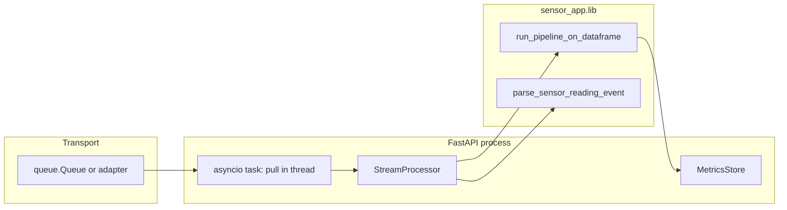

# spec_ch3.md — Event-driven consumer (build specification)

**Project name:** **sensor_app**.

This document is a **detailed implementation specification** for the **queue-backed streaming ingestion path**: events arrive on a transport, are validated and batched, run through the **same** Polars pipeline and metric definitions as **`POST /process`** (**spec_ch1.md**), and persist into **`metric_snapshots`**. It is written so an engineer or coding agent can implement or verify the feature without reading the whole codebase first.

**Dependencies:** **spec_ch1.md** must be satisfied (library, `MetricsStore`, pipeline, batch API). **spec_ch2.md** (LLM) is **orthogonal**; streaming and **`/llm/*`** may coexist in one process.

**Normative language:** **must** / **must not** indicate requirements; **should** indicates strong recommendations.

---

## 1. Goals and non-goals

### 1.1 Goals

1. **Consume** structured sensor events from a **blocking** source (in-repo: **`queue.Queue`**) without blocking the FastAPI event loop.
2. **Reuse** **`run_pipeline_on_dataframe`** (or equivalent single entrypoint) so **batch** and **stream** paths share validation, resample, DQ, and **`compute_station_metrics`** logic—**no forked metric math**.
3. **Persist** results via **`MetricsStore.save_snapshot`** with the **same JSON shape** as batch processing.
4. **Survive** malformed events and pipeline errors: the consumer loop **must not** exit; counters and **`last_error`** reflect failure.
5. **Support at-least-once** delivery: duplicate **`event_id`** values **must not** double-count rows (bounded dedupe).
6. **Expose** processing status over HTTP and extend metrics query with **optional metric-type filter**.
7. **Isolate transport**: swapping **`queue.Queue`** for a broker **should** require a new adapter only, not changes to **`StreamProcessor`** core logic.

### 1.2 Non-goals (explicit)

* **No** distributed exactly-once guarantees in this repo (SQLite, single process); document how production would add acks/partitions.
* **No** modification of **`producer.py`** as the reference event source (read-only contract).
* **No** requirement to ingest into **`sensor_data.db`** from the stream path (optional future); current design writes **aggregates** only to **`metric_snapshots`**.
* **No** WebSocket or SSE event fan-out in scope.

---

## 2. Glossary

| Term | Meaning |
|------|---------|
| **Event** | One dict (or typed object serialized to dict) from the producer with `event_type`, ids, timestamp, readings. |
| **Transport** | Mechanism that blocks until the next item (e.g. `Queue.get`). |
| **Buffer** | In-memory list of **flattened rows** ready to become a Polars `DataFrame` on flush. |
| **Flush** | Build `DataFrame` → per-**station_id** slice → **`run_pipeline_on_dataframe`** → **`save_snapshot`**. |
| **Sentinel** | **`None`** dequeued meaning end-of-stream for the demo producer; triggers flush. |
| **Backlog** | Items waiting in the transport (e.g. `queue.Queue.qsize()`). |

---

## 3. High-level architecture

**Threading model:** The FastAPI app runs an **asyncio** task whose loop **awaits `asyncio.to_thread(queue.get, …)`** (or get with timeout) then **awaits `asyncio.to_thread(processor.handle, item)`**. **`StreamProcessor`** uses a **`threading.Lock`** around buffer and stats because **`handle`** and HTTP **`flush`** may run from different threads.

---

## 4. Event contract (producer-facing)

Implementers **must** treat **`producer.py`** as the **reference** for shapes and timing. The following is the **logical contract** the parser enforces.

### 4.1 Required top-level keys (for `sensor_reading`)

| Key | Type | Notes |
|-----|------|--------|
| `event_id` | string (recommended) | Used for dedupe; if missing, dedupe does not apply to that event. |
| `event_type` | string | **Must** equal **`"sensor_reading"`** for successful parse. |
| `timestamp` | string | ISO-8601; passed through to pipeline (cast to UTC datetime in pipeline). |
| `station_id` | string or coercible | Coerced with **`str()`** in parser. |
| `device_id` | string or coercible | Coerced with **`str()`** in parser. |
| `readings` | object/dict | Map of numeric column → number or **`null`**. |

Optional: `metadata` — ignored by the parser unless future spec extends it.

### 4.2 Required keys inside `readings`

Align with **spec_ch1** column names:

* `discharge_pressure`
* `air_flow_rate`
* `power_consumption`
* `motor_speed`
* `discharge_temp`

Each value **must** be **`null`**, **`int`**, or **`float`** after JSON parsing. **`bool`** **must** be rejected (parser returns **`None`** → malformed). Missing key → treat as **`null`** in the flattened row.

### 4.3 Sentinel

**`None`** returned from the queue **must** mean **end of stream** for the in-process demo: processor **`handle(None)`** **must** flush the buffer with reason **`stream_sentinel`** (or equivalent documented string in **`dq_extra`**).

### 4.4 Malformed events

Any of: wrong `event_type`, missing required keys, `readings` not a dict, non-numeric reading where a float is required → **`parse_sensor_reading_event` returns `None`**. Processor **increments `events_malformed`**, logs at INFO with `event_id` if present, **does not** append to buffer.

---

## 5. Parsing layer (`sensor_event` module)

**Responsibility:** Map one producer dict → one flat **`dict`** row matching **`SqliteSensorRepository.load_readings`** column names, or **`None`**.

**Output row keys:** `timestamp`, `station_id`, `device_id`, plus all **`READING_NUMERIC_KEYS`** (possibly **`None`** for missing sensor values).

**Must not:** Import FastAPI. **Must not** call the pipeline (caller builds `DataFrame`).

**Tests must** cover: valid producer shape, wrong `event_type`, bad readings type, **`None`** readings for each numeric key, duplicate handling at processor level (not parser).

---

## 6. Stream processor (`stream_consumer` module)

### 6.1 Responsibilities

1. Accept **`handle(item: dict | None)`** from the transport loop.
2. Maintain **thread-safe** buffer and **statistics**.
3. **Dedupe** by **`event_id`** when it is a **`str`**: if already in bounded set, increment **`events_duplicate`** and return without buffering.
4. On flush: build **Polars** `DataFrame` from buffer rows; **partition logically by `station_id`**; for each distinct `station_id`, call **`run_pipeline_on_dataframe(sub_df, station_id, schema, config, dq_extra=…)`**; **`save_snapshot`** each payload with a fresh **`computed_at`** ISO timestamp (UTC).
5. **`dq_extra`** **must** include at least **`ingest: "stream_consumer"`** and **`flush_reason`** in **`{buffer_threshold, manual, stream_sentinel}`** (or documented superset) for traceability in stored DQ JSON.

### 6.2 Flush triggers

| Trigger | Condition |
|---------|-----------|
| **Threshold** | `len(buffer) >= flush_min_events` after append (**must** use `max(1, configured)`). |
| **Manual** | **`POST /stream/flush`** calls **`processor.flush()`**. |
| **Sentinel** | **`handle(None)`**. |

**Note:** Threshold flush may run **outside** the lock (release before `_flush_all`) to avoid deadlocks; design **must** document if **`handle`** re-enters the lock in `_flush_all`.

### 6.3 Dedupe memory bound

**Must** implement **FIFO eviction** from a bounded set of seen ids (configurable **`max_seen_event_ids`**, minimum **1000** enforced in code): when over capacity, drop oldest ids from the set so memory stays bounded (**at-least-once** may re-accept very old ids after eviction—document this).

### 6.4 Statistics (`status_snapshot`)

**Must** expose (names stable for JSON API):

* `consumer_running` — bool
* `events_received` — count of dequeued non-empty messages (including malformed, before dedupe drop)
* `events_processed_rows` — sum of row heights passed through successful pipeline flushes
* `events_malformed` — parse failures
* `events_duplicate` — dedupe hits
* `flush_count` — number of successful flush operations that wrote at least one snapshot (or document if incremented per station)
* `buffered_rows_pending` — current buffer length
* `last_error` — string or null (`dataframe_build: …`, `pipeline_or_save: …`, etc.)
* `backlog_depth` — from caller (`Queue.qsize()` or null if unknown)

### 6.5 Error handling on flush

* **DataFrame build failure:** set **`last_error`**, log exception, **discard** buffer contents or **retain**—implementation **must** document; current reference **clears** buffer only after successful extract (rows taken under lock then built outside).
* **Pipeline / save failure:** set **`last_error`**, log exception; **must not** crash the consumer task.

---

## 7. Pipeline integration (`run_pipeline_on_dataframe`)

**Must** (see **spec_ch1**):

* Filter or assume rows belong to the given **`station_id`** (reference filters `raw` to station before processing).
* Run validate → missing strategy → resample → DQ → metrics.
* Return the **same** payload dict shape as **`run_station_pipeline`** for **`save_snapshot`**.

**Streaming-specific:** Pass **`dq_extra`** through to **`DataQualityReport.extra`** merge so operators can see **`ingest`** and **`flush_reason`**.

---

## 8. FastAPI wiring

### 8.1 Application factory

**Must** support **`create_app(settings, event_queue=optional_queue)`**. If **`event_queue` is `None`**, no stream task starts.

### 8.2 Settings

| Setting | Purpose |
|---------|---------|
| `stream_consumer_enabled` | If true **and** `event_queue` set, start consumer task at lifespan startup. |
| `stream_flush_min_events` | Passed to **`StreamProcessor`**. |
| `stream_max_seen_event_ids` | Dedupe bound. |
| `rate_limit_stream_status` | slowapi limit for **`GET /stream/status`**. |
| `rate_limit_stream_flush` | slowapi limit for **`POST /stream/flush`**. |

If **`stream_consumer_enabled`** is true but **`event_queue`** is missing, **must** log **warning** and **not** crash startup.

### 8.3 Lifespan

**On startup:** init **`MetricsStore`**, wire LLM per **spec_ch2**, optionally **`_start_stream_consumer_task`**.

**On shutdown:** cancel stream task, set stop event, **await** cancellation; close LLM HTTP client.

### 8.4 Stream task loop (reference behavior)

* Poll queue with **timeout** (e.g. 0.5s) so shutdown can interrupt.
* Use a sentinel object for “empty timeout” vs real **`None`** sentinel from producer if both are needed; reference uses **`_QUEUE_EMPTY`** singleton for timeout.

---

## 9. HTTP API (extensions)

### 9.1 `GET /stream/status`

* If no processor attached: return **`200`** with **`enabled: false`** and human-readable **`detail`** (how to enable).
* If attached: return **`200`** with **`enabled: true`** and **`status_snapshot`** fields; **`backlog_depth`** from **`event_queue.qsize()`** when queue is a **`queue.Queue`**, else **`null`**.

### 9.2 `POST /stream/flush`

* If no processor: **`503`** with clear body.
* Else: **`await asyncio.to_thread(processor.flush)`**; return **`200`** with **`ok: true`** and short detail.

### 9.3 `GET /metrics/{station_id}` extension

* Query param **`metric_key`**: when set, response **must** still return the same top-level list of snapshots but each device’s **`metrics`** map **only** contains that key (and empty object if missing)—implemented server-side after load, **not** by mutating SQLite JSON in place.

---

## 10. Demo runner

**`run_streaming_stack.py`** **must**:

1. Construct **`queue.Queue()`**.
2. Build **`Settings(stream_consumer_enabled=True)`** (or read env).
3. Instantiate **`SensorEventProducer`** from **`producer.py`** with that queue.
4. **`create_app(settings, event_queue=q)`**.
5. Start producer thread/process as defined by **`producer`**, then **`uvicorn.run(app, …)`**.

Document env vars **`PORT`**, **`HOST`**, **`STREAM_SPEED_MULTIPLIER`** in **README**.

---

## 11. Persistence and semantics

* **Upsert key:** Same as batch: **`(station_id, window_start, window_end)`** — streaming replays for the **same logical window** **replace** prior rows (see **spec_ch1** idempotency).
* **Window bounds:** Derived from **resampled** data inside pipeline; multiple flushes for the same station may produce **different windows** if event timestamps span different ranges—**document** for operators.

---

## 12. Configuration summary (environment)

All **`SENSOR_APP_*`** names **must** appear in **README** and **`.env.example`** (commented optional vars acceptable):

* `SENSOR_APP_STREAM_CONSUMER_ENABLED`
* `SENSOR_APP_STREAM_FLUSH_MIN_EVENTS`
* `SENSOR_APP_STREAM_MAX_SEEN_EVENT_IDS`
* `SENSOR_APP_RATE_LIMIT_STREAM_STATUS`
* `SENSOR_APP_RATE_LIMIT_STREAM_FLUSH`

Plus inherited: **`SENSOR_APP_SCHEMA_PATH`**, **`SENSOR_APP_METRICS_DB_PATH`**, **`SENSOR_APP_SENSOR_DB_PATH`** (producer reads historical DB for replay), **`SENSOR_APP_*`** pipeline thresholds.

---

## 13. Observability

* Log **malformed** events with **`event_id`** (or placeholder).
* Log **exceptions** on flush with **`flush_reason`**.
* Startup log **must** indicate stream consumer on/off and whether fallback LLM wired (**spec_ch2**).

---

## 14. Testing requirements

| Area | Must |
|------|------|
| **Parse** | Valid/invalid producer dicts, **`None`** readings. |
| **Processor** | Flush writes snapshot (tmp metrics DB), idempotent **`event_id`**, sentinel flush. |
| **API** | **`TestClient`** with **`event_queue`** + **`stream_consumer_enabled`**: status enabled, flush 200, 503 when disabled; **`metric_key`** filter on metrics. |
| **Isolation** | Stream unit tests **without** real broker or network. |

---

## 15. Acceptance checklist

Use this to verify the implementation is complete:

- [ ] `parse_sensor_reading_event` matches §4–§5.
- [ ] `StreamProcessor` dedupe, buffer, three flush reasons, stats, thread safety.
- [ ] `run_pipeline_on_dataframe` used for every flush; `dq_extra` present.
- [ ] `create_app(..., event_queue=...)` + lifespan task + clean shutdown.
- [ ] `GET /stream/status`, `POST /stream/flush`, `GET /metrics/...?metric_key=`.
- [ ] `run_streaming_stack.py` runs producer + API together.
- [ ] README: how to run, env vars, failure behavior.
- [ ] **design_doc.md** §8 (or equivalent): multi-instance deploy + backlog strategy.
- [ ] **docs/api/README.md** documents new routes with examples.

---

## 16. Reference implementation map (this repository)

| Spec area | Primary modules |
|-----------|-----------------|
| Parser | `src/sensor_app/lib/sensor_event.py` |
| Processor | `src/sensor_app/lib/stream_consumer.py` |
| Pipeline entry | `src/sensor_app/lib/pipeline.py` — `run_pipeline_on_dataframe` |
| HTTP | `src/sensor_app/api/main.py` |
| Settings | `src/sensor_app/settings.py` |
| Demo | `run_streaming_stack.py`, `producer.py` |
| Tests | `tests/test_stream_consumer.py`, `tests/test_stream_api.py` |

---

## 17. Relationship to other specs

**spec_ch3.md** extends **spec_ch1.md** only along the streaming axis; it **must not** redefine metric formulas or core REST contracts except where explicitly extended above. **spec_ch2.md** remains optional LLM surface.
